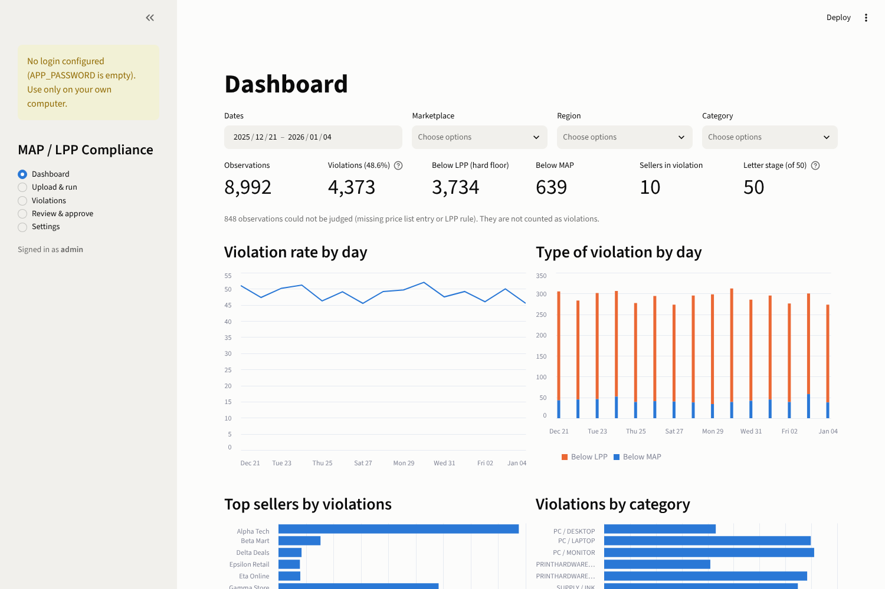
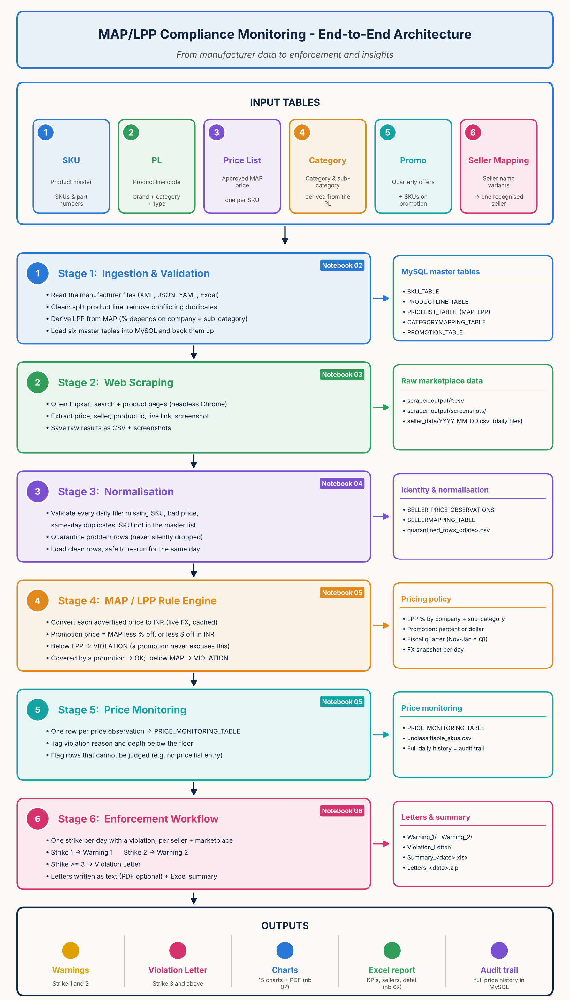
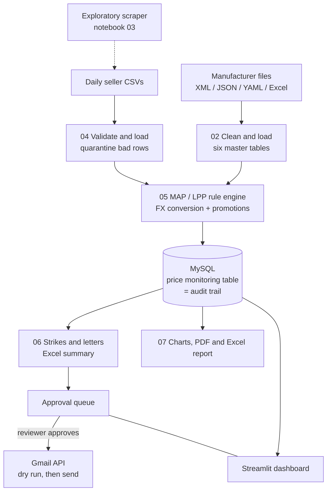
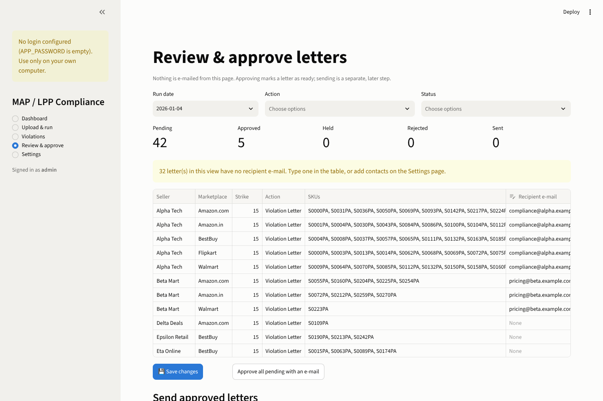

# MAP / LPP Compliance Monitor

A proof-of-concept that watches advertised prices on marketplaces, checks them against a manufacturer's pricing
policy, and turns violations into reviewed, trackable enforcement letters.

> **Data note:** everything in this repository runs on **synthetic sample data**. No real manufacturer,
> seller or marketplace data is included, and the LPP percentages in the settings are illustrative defaults.



## The problem

Manufacturers publish a **MAP** (Minimum Advertised Price) and often a stricter **LPP** (Lowest Permitted Price) for
each product. Resellers advertise on many marketplaces, in many currencies, every day. Checking that by hand does not
scale, and the rules have exceptions (an approved promotion can excuse a price below MAP, but never below LPP). Enforcement also
needs consistency: the same seller should get the same escalation path every time.

## What it does

0. **(Exploratory) Collects live prices.** A proof-of-concept scraper (notebook 03) drives a headless browser to read price,
   seller, product id and link, and saves a screenshot as evidence. It is a side experiment and not part of the main pipeline
   (see below).
1. **Cleans and loads the manufacturer's master data** (XML, JSON, YAML, Excel) into six MySQL tables, removing
   conflicting duplicates and deriving the LPP from the MAP.
2. **Loads daily seller price files** with validation. Bad rows (missing SKU, unparseable price, same-day duplicates, SKU not in
   the master list) are **quarantined to a file, never silently dropped**. A day can be reloaded safely.
3. **Classifies every price observation**, converting to INR with cached exchange rates and applying the promotion
   rules.
4. **Escalates per seller and marketplace**: one strike per day with a violation. Strike 1 gives Warning 1, strike 2
   gives Warning 2, and strike 3 or more gives a Violation Letter.
5. **Generates the letters and an Excel summary**, then puts every letter in an **approval queue**.
6. **A person reviews and approves** in a web app. Approved letters are sent through the Gmail API with a dry run first.
7. **Dashboards and reports**: 15 charts, a PDF pack and an Excel report, plus the full price history in MySQL as an audit trail.

### The classification rule

Checks run in this order, and the first match wins:

| Order | Condition | Result |
|---|---|---|
| 1 | Missing price list entry or LPP rule | *Cannot be judged* (flagged, not counted as a violation) |
| 2 | Advertised price below LPP | **Violation**. A promotion never excuses this |
| 3 | Advertised price at or above the promotion price | Compliant (covered by the promotion) |
| 4 | Advertised price below MAP | **Violation** |
| 5 | Otherwise | Compliant |

Promotion price is `MAP × (1 − pct/100)` for a percent promotion, or `MAP − dollar amount` converted to INR for a dollar
promotion. Non-price perks (a free accessory, for example) are not treated as price promotions. LPP is `MAP × (1 − pct/100)`, where
the percentage depends on the manufacturer and the product sub-category. Quarters are fiscal by default (Nov to Jan is Q1) and can be switched to calendar.

## Architecture



The same flow as a diagram that GitHub renders from text:



The same pipeline exists in two forms:

* **`notebooks/`** is one Google Colab notebook per workflow, every cell documented with what it does and why.
* **`app/`** is a Streamlit web app plus a command-line runner (`run_step.py`) that runs the same steps, so a scheduler
  (cron or Task Scheduler) can run the daily job without the UI. The step scripts are **generated from the notebooks**, so
  there is one source of truth for the logic.

## The scraper proof of concept

Notebook `notebooks/03_Flipkart_Scraper.ipynb` is an **exploratory proof of concept** showing how the daily seller files
could be produced automatically. It runs a headless Chrome browser (Selenium) in Colab, searches a marketplace for chosen terms, and
for each product captures the price, seller name, product id and link, plus a screenshot, then reshapes the rows into the same column layout
as the daily seller files. It also checks how many scraped product ids exist in the SKU master.

It is **outside the scope of the main pipeline**: the pipeline and the web app start from the daily seller CSV files, and the
files in this repository are synthetic. The scraper is deliberately small and polite (a few products per search term, pauses between
pages). It is tied to one site's page layout, so expect to adjust it when that layout changes. It covers only one marketplace, because other
marketplaces block automated access or prohibit it in their terms. **Check a site's terms of use before scraping it, and use it
only where that is permitted.**

## The web app

| Page | Purpose |
|---|---|
| Dashboard | KPIs, violation rate by day, violation type, top sellers, category and marketplace views |
| Upload & run | Upload source and daily files, validate them, run the pipeline with live output and a run history |
| Violations | Filter and export every observation; see strikes per seller |
| Review & approve | Edit recipients, approve or hold letters, preview the text, send approved letters |
| Settings | Quarter definition, strike threshold, LPP percentages, letter wording, seller contacts, seller-name mapping, Gmail |



## Quick start (local)

You need Python 3.10+ and MySQL 8.

```bash
cd app
python -m venv .venv
.venv\Scripts\activate          # macOS/Linux: source .venv/bin/activate
pip install -r requirements.txt
cp .env.example .env            # then set MAP_DB_PASS, APP_USER and APP_PASSWORD
streamlit run app.py
```

Open http://localhost:8501, go to **Upload & run**, click **Copy sample data into the project**, choose **Full setup**
and click **Run now**. `app/docker-compose.yml` starts a MySQL 8 container if you have Docker. Full setup notes, including
the Gmail setup, are in [`app/README.md`](app/README.md).

## Design decisions worth knowing

* **Missing is not zero.** An early version turned a blank promotion value into `0`, which silently converted percent
  promotions into "MAP minus $0". Unknown values are now `NULL` and the row is flagged instead of guessed.
* **Quarantine, don't drop.** Every rejected input row lands in a per-day file with the reason.
* **Idempotent loads.** Re-running a day replaces that day. Re-running the letters never resets a letter that was already approved or sent.
* **Case-sensitive identities.** MySQL's default collation is case-insensitive, which merges sellers that differ only by
  case. Seller, marketplace and region columns use a binary collation.
* **Send safely.** A letter is claimed (`Sending`) in the database before the e-mail goes out, becomes `Sent` only after
  Gmail accepts it, and returns to `Approved` with the error text if it fails. A sent letter cannot be sent twice. Gmail
  access uses the send-only scope.
* **Secrets stay out of the code.** Passwords come from environment variables or a `.env` file that is git-ignored.

## Tech stack

Python, pandas, SQLAlchemy, MySQL 8, Streamlit, matplotlib, openpyxl, ReportLab, Gmail API (OAuth),
Google Colab, Docker Compose (optional).

## Status and limitations

* A proof of concept, run locally against MySQL 8 with synthetic data. The Gmail send was verified with one real test
  e-mail; the rest of the sending logic was tested against a stand-in for the Gmail service.
* There is no automated test suite beyond the self-checks inside the notebooks and manual testing of the app. Cloud deployment (for example
  AWS) has not been tested.
* The app has a single shared login. It is meant for use on your own computer or a private network, not for exposure to the internet.
* The scraper (notebook 03) is a proof of concept, is not wired into the app, and depends on one site's page layout.
  Any scraping should respect that site's terms of use.
* Letter wording is a template with placeholders; have your own policy and legal wording approved before sending anything.

## License

Add the license of your choice before publishing (for example MIT).
